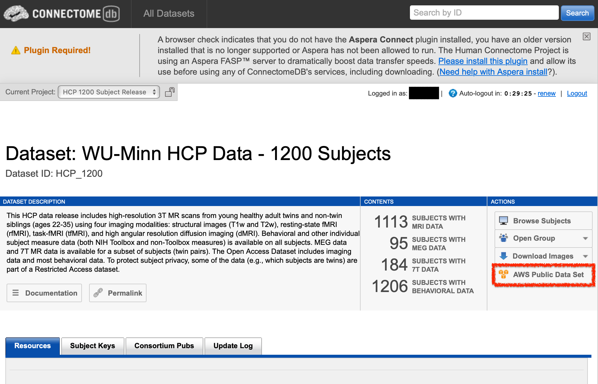
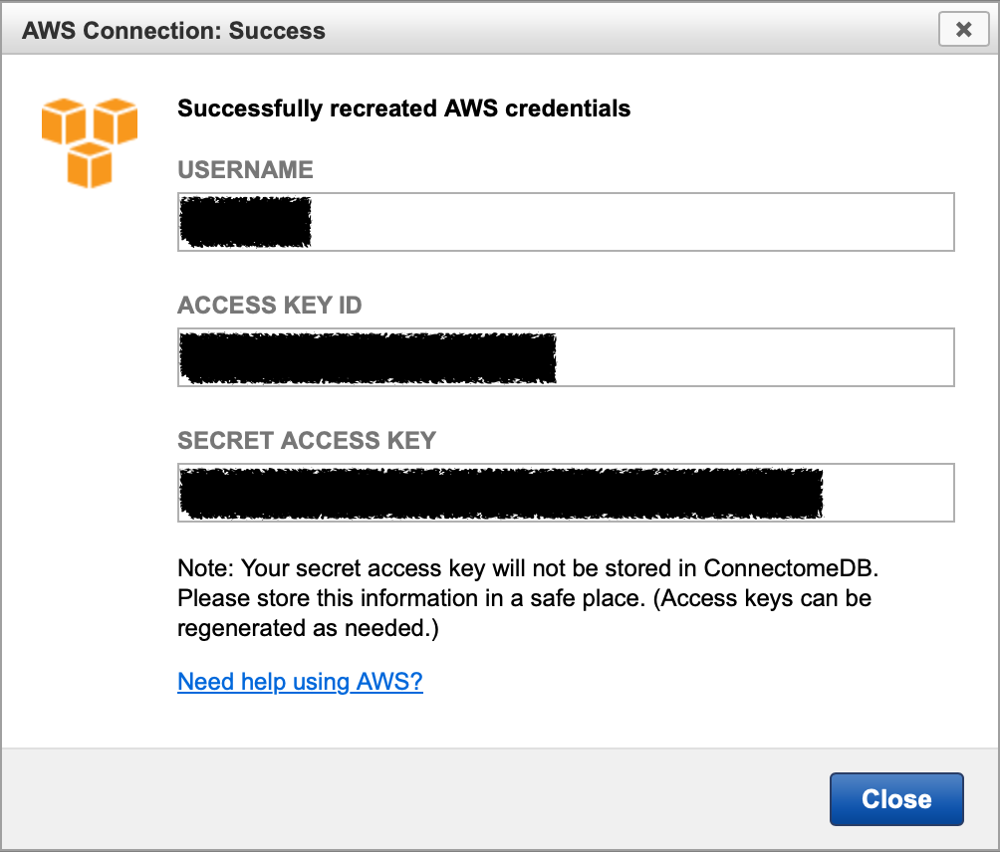

# hcp-example-scripts

Before executing codes, please make sure hcp access and credentials are ready.

1. Request for access to AWS and copy the keys
    <div style="text-align: left;">
        
    </div>

    <div style="text-align: left;">
        
    </div>

2. Check if `~/.aws/credentials` exists. If not, create one.
    ``` Terminal
    vim ~/.aws/credentials
    ```

3. Add following into `~/.aws/credentials`
    ```Shell
    [hcp]
    aws_access_key_id = <the access key you just copied>
    aws_secret_access_key = <the secret access key you just copied>
    ```

4. Now you are free to run the codes.
